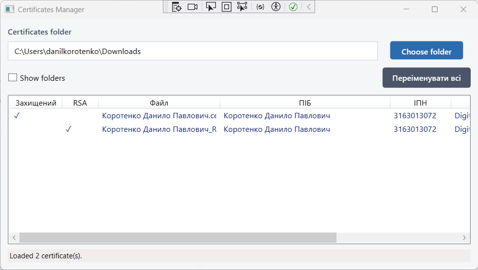

# Certificates Manager

Windows desktop application for managing `.cer` certificate files in a local folder. It parses certificate metadata, helps organize files by person name, and keeps the list in sync when the folder changes.



## Features

### Certificates folder

- Choose a **certificates folder** via path field or **Choose folder** dialog.
- The selected folder is saved on exit and restored on the next launch.
- Certificate files are sorted by **Date Modified** (newest first).

### Show folders

- **Show folders** checkbox toggles folder browsing on or off.
- The checkbox state is saved in application settings and restored on launch.

When **Show folders** is enabled:

- The list displays **subdirectories** alongside `*.cer` files.
- A **`..`** entry appears at the top to navigate to the parent directory.
- **Double-click** a folder to open it — the list shows that folder's subdirectories and certificates, and the **Certificates folder** path is updated accordingly.
- The folder watcher also reacts to directory create/delete/rename events.

When **Show folders** is disabled:

- Only `*.cer` files in the current folder are shown.
- Folder navigation is not available.

### Automatic folder watch

- The application **watches the current folder** and **updates the file list automatically** when files (and, when folder support is on, directories) are added, removed, renamed, or modified.

### Certificate information

For each certificate, the list shows:

| Column | Description |
|--------|-------------|
| **Захищений** | Check mark if Enhanced Key Usage contains OID `1.3.6.1.4.1.19398.1.1.8.22` |
| **RSA** | Check mark if Key Usage includes Digital Signature, Non-Repudiation, and Key Encipherment |
| **Файл** | File name |
| **ПІБ** | **Прізвище Ім'я Побатькові** extracted from the certificate CN (Common Name) |
| **ІПН** | 10-digit tax ID parsed from subject `SERIALNUMBER = TINUA-<10 digits>` |
| **Key Usage** | Key Usage extension as readable flags and hex value |

- **Left-click** on **ПІБ** or **ІПН** copies the cell value to the clipboard.
- A **status bar** at the bottom shows operation results and error messages.

### Rename and delete

**Rename all** button:

- **Переіменувати всі** renames **all certificate files** currently shown in the list (folders are skipped).
- Uses the same bulk rename rules as the context menu:
  - RSA = true → `<ПІБ>.cer`
  - RSA = false → `<ПІБ>_RSA.cer`

**Single file** (right-click a certificate row):

- **Переіменувати в `<ПІБ>`** — renames to `<ПІБ>.cer`
- **Переіменувати в `<ПІБ>_RSA`** — when RSA applies, renames to `<ПІБ>_RSA.cer`
- **Видалити файл** — deletes the certificate file

**Multiple files** (select several certificate rows, then right-click):

- **Переіменувати відповідно ПІБ та ПІБ_RSA** — **bulk rename** of selected files using RSA:
  - RSA = true → `<ПІБ>.cer`
  - RSA = false → `<ПІБ>_RSA.cer`
- **Видалити всі** — **bulk delete** of all selected files

## Requirements

- Windows
- [.NET 9 SDK](https://dotnet.microsoft.com/download) (for building from source)

## Build and run

```bash
dotnet build
dotnet run --project CertificatesManager/CertificatesManager.csproj
```

## Technology

- WPF (.NET 9)
- `System.Security.Cryptography.X509Certificates` for certificate parsing
- `FileSystemWatcher` for folder monitoring
